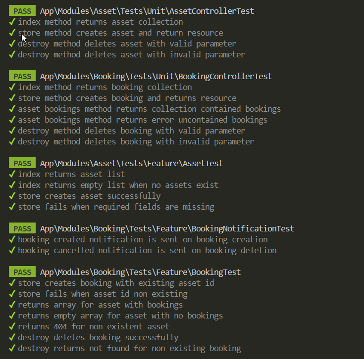

# API Booking TZ

Данный API предоставляет возможности по управлению ресурсами и бронированиями.

## Установка и запуск

### Требования
- PHP 8.2+ (или указанная версия в Sail)
- Composer
- Docker & Docker Compose (для использования Laravel Sail)

### Установка зависимостей
1. Клонируйте репозиторий:
   ```bash
   git clone https://github.com/bhaakl/php-booking-tz.git
   cd your-repo
   ```
2. Установите зависимости Composer:
   ```bash
   composer install
   ```
3. Скопируйте файл конфигурации и сгенерируйте ключ приложения:
   ```bash
   cp .env.example .env
   php artisan key:generate
   ```

### Запуск API

#### Локально (без Docker)
Запустите встроенный сервер:
```bash
php artisan serve
```
API будет доступен по адресу: [http://127.0.0.1:8000](http://127.0.0.1:8000)

#### С Docker (Laravel Sail)
1. Установите Sail (если ещё не установлен):
   ```bash
   composer require laravel/sail --dev
   php artisan sail:install
   ```
   Выберите необходимые сервисы (для нашего прииложения достаточно Mariadb).

2. Запустите контейнеры:
   ```bash
   ./vendor/bin/sail up -d
   ```
   API будет доступен по адресу: [http://localhost](http://localhost) (порт задается в переменной `APP_PORT` в .env)

---

## Маршруты API

### Resource Endpoints

#### Получить список всех ресурсов
- **Метод:** `GET`
- **URL:** `/api/v1/resources`
- **Описание:** Возвращает коллекцию ресурсов.
- **Ответ:**  
  Пример структуры JSON:
  ```json
  {
      "data": [
          {
              "id": 1,
              "name": "Resource Name",
              "type": "Type name",
              "description": "Description text"
          },
          // ...
      ]
  }
  ```

#### Создать ресурс
- **Метод:** `POST`
- **URL:** `/api/v1/resources`
- **Описание:** Создаёт новый ресурс.
- **Тело запроса:**  
  ```json
  {
      "name": "Resource Name",
      "type": "Resource Type",
      "description": "Описание ресурса"
  }
  ```
- **Ответ:**  
  Пример успешного ответа (201 Created):
  ```json
  {
      "data": {
          "id": 1,
          "name": "Resource Name",
          "type": "Resource Type",
          "description": "Описание ресурса"
      }
  }
  ```

#### Получить бронирования для ресурса
- **Метод:** `GET`
- **URL:** `/api/v1/resources/{id}/bookings`
- **Описание:** Возвращает бронирования для заданного ресурса (ID ресурса).
- **Ответ:**  
  Пример структуры JSON:
  ```json
  {
      "data": [
          {
              "id": 1,
              "asset_id": 1,
              "user_id": 2,
              "start_time": "2023-06-01T12:00:00",
              "end_time": "2023-06-01T14:00:00"
          },
          // ...
      ]
  }
  ```

---

### Booking Endpoints

#### Получить список всех бронирований
- **Метод:** `GET`
- **URL:** `/api/v1/bookings`
- **Описание:** Возвращает коллекцию бронирований.
- **Ответ:**  
  Пример структуры JSON:
  ```json
  {
      "data": [
          {
              "id": 1,
              "asset_id": 1,
              "user_id": 2,
              "start_time": "2023-06-01T12:00:00",
              "end_time": "2023-06-01T14:00:00"
          },
          // ...
      ]
  }
  ```

#### Создать бронирование
- **Метод:** `POST`
- **URL:** `/api/v1/bookings`
- **Описание:** Создаёт бронирование.
- **Тело запроса:**  
  ```json
  {
      "asset_id": 1,
      "user_id": 2,
      "start_time": "2023-06-01T12:00:00",
      "end_time": "2023-06-01T14:00:00"
  }
  ```
- **Ответ:**  
  Пример успешного ответа (201 Created):
  ```json
  {
      "data": {
          "id": 1,
          "asset_id": 1,
          "user_id": 2,
          "start_time": "2023-06-01T12:00:00",
          "end_time": "2023-06-01T14:00:00"
      }
  }
  ```

#### Отменить бронирование
- **Метод:** `DELETE`
- **URL:** `/api/v1/bookings/{id}`
- **Описание:** Отменяет бронирование с указанным ID.
- **Ответ:**  
  При успешном удалении возвращается HTTP статус `204 No Content`.

---

## Тестирование

### Запуск тестов
Чтобы запустить unit и feature тесты, выполните:
```bash
./vendor/bin/phpunit
```
Скрины, какие тесты имеются:

<p align="center">
  
</p>

### Особенности тестирования
- Используется Unit/Feature-тестирование.
- Для тестов используются фабрики для моделей `Asset`, `Booking` и `User`.
- В тестах применяется механизм фейковых уведомлений для проверки паттерна Observer.

---

## Документация API

Документация генерируется с помощью [Swagger/OpenAPI](https://swagger.io/) на основе PHPDoc-аннотаций. Для генерации документации можно использовать [L5-Swagger](https://github.com/DarkaOnLine/L5-Swagger).

Чтобы генерировать, выполните: 
```bash
php artisan l5-swagger:generate
```
